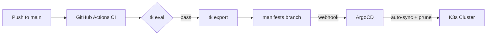

# nas-k3s

[](https://github.com/DanielRamosAcosta/nas-k3s/actions/workflows/validate.yml)

K3s homelab infrastructure-as-code using **Jsonnet + Tanka** with a fully automated **ArgoCD GitOps** pipeline. Manages 30+ self-hosted services on a personal NAS — media, downloads, databases, monitoring, authentication, and system infrastructure.

## Architecture



All Kubernetes manifests are generated from Jsonnet source files. No YAML is hand-written — everything is compiled, exported, and deployed through a GitOps pipeline.

- **Jsonnet + Tanka** — declarative app definitions with typed K8s API bindings (`k8s-libsonnet 1.29`)
- **ArgoCD** — continuous delivery with auto-sync, self-heal, and pruning
- **Traefik** — ingress controller with IngressRoute CRDs and Let's Encrypt TLS
- **Authelia** — SSO/OIDC provider with forward-auth middleware
- **Sealed Secrets** — encrypted secrets safe to commit to git

## GitOps Flow

Every change follows the same path from code to cluster:

1. **Push to `main`** — developer commits Jsonnet changes
2. **CI validates** — GitHub Actions runs `tk eval` on all environments
3. **CI exports** — on main branch, `tk export` compiles all manifests to YAML
4. **Manifests branch** — exported YAML is published to the `manifests` branch
5. **ArgoCD syncs** — a GitHub webhook notifies ArgoCD, which auto-syncs changes to the cluster

Direct `tk apply` is never used. ArgoCD is the single source of truth for what runs in the cluster.

## Services

### Media
| Service | Description |
|---------|-------------|
| **Jellyfin** | Media server for movies, TV, and music |
| **Immich** | Self-hosted photo/video backup (Google Photos alternative) |
| **Navidrome** | Music streaming server (Subsonic-compatible) |
| **Invidious** | Privacy-focused YouTube frontend |
| **Gitea** | Lightweight self-hosted Git service |
| **Booklore** | Book library manager |
| **Beets** | Music library organizer and tagger |
| **SFTPGo** | SFTP/WebDAV file access |

### Arr Stack (Downloads)
| Service | Description |
|---------|-------------|
| **Sonarr** | TV show management and automation |
| **Radarr** | Movie management and automation |
| **Lidarr** | Music management and automation |
| **Deluge** | BitTorrent client (routed through Gluetun VPN) |
| **slskd** | Soulseek client for music discovery |
| **JDownloader** | Direct download manager |
| **Norznab** | Custom Newznab-compatible indexer proxy |

### Databases
| Service | Description |
|---------|-------------|
| **PostgreSQL** | Primary database (with pgvector for Immich) |
| **MariaDB** | MySQL-compatible database |
| **Valkey** | Redis-compatible in-memory store |

### Monitoring
| Service | Description |
|---------|-------------|
| **Prometheus** | Metrics collection and alerting |
| **Grafana** | Dashboards and visualization |
| **Loki** + **Promtail** | Log aggregation |
| **Node Exporter** | Host-level metrics |
| **Smartctl Exporter** | Disk health monitoring (S.M.A.R.T.) |
| **NUT Exporter** | UPS monitoring |

### System
| Service | Description |
|---------|-------------|
| **Traefik** | Ingress controller with Let's Encrypt |
| **ArgoCD** | GitOps continuous delivery |
| **Sealed Secrets** | Secret encryption for git |
| **Cloudflare DDNS** | Dynamic DNS updates |
| **Gluetun** | VPN client (shared by download services) |
| **Heartbeat** | Uptime health check |

### Auth & Dashboard
| Service | Description |
|---------|-------------|
| **Authelia** | SSO, OIDC provider, and forward-auth |
| **Kubernetes Dashboard** | Cluster web UI |

## Tech Stack

| Tool | Purpose |
|------|---------|
| [Tanka](https://tanka.dev) | Kubernetes deployment tool built on Jsonnet |
| [Jsonnet](https://jsonnet.org) | Data templating language for all K8s manifests |
| [jsonnet-bundler](https://github.com/jsonnet-bundler/jsonnet-bundler) | Dependency manager for Jsonnet libraries |
| [k8s-libsonnet](https://github.com/jsonnet-libs/k8s-libsonnet) | Typed Kubernetes API bindings (v1.29) |
| [ArgoCD](https://argo-cd.readthedocs.io) | GitOps continuous delivery |
| [Sealed Secrets](https://sealed-secrets.netlify.app) | Encrypt secrets for safe git storage |
| [Traefik](https://traefik.io) | Ingress controller with automatic TLS |
| [Authelia](https://www.authelia.com) | Authentication and SSO |

### Vendored Helm Charts

| Chart | Version |
|-------|---------|
| Traefik | 36.3.0 |
| ArgoCD | 9.4.10 |
| Sealed Secrets | 2.18.4 |
| Kubernetes Dashboard | 7.13.0 |

## Directory Layout

```
nas-k3s/
├── lib/                        # Jsonnet libraries (one .libsonnet per app)
│   ├── utils.libsonnet         #   Shared helpers (PV, PVC, secrets, ingress, etc.)
│   ├── versions.json           #   Centralized container image versions
│   ├── arr/                    #   Download/media automation apps
│   ├── auth/                   #   Authentication (Authelia)
│   ├── databases/              #   PostgreSQL, MariaDB, Valkey
│   ├── media/                  #   Media servers and tools
│   ├── monitoring/             #   Prometheus, Grafana, Loki, exporters
│   ├── system/                 #   Traefik, ArgoCD, Sealed Secrets, Cloudflare
│   └── dashboard/              #   Kubernetes Dashboard
├── environments/               # Tanka environments (one per namespace)
│   ├── <category>/main.jsonnet #   Composes app modules for the namespace
│   └── <category>/spec.json    #   Namespace and API server config
├── charts/                     # Vendored Helm charts (via chartfile.yaml)
├── scripts/
│   └── encrypt-secret.sh       # Sealed Secrets encryption helper
├── .github/workflows/
│   └── validate.yml            # CI: validate + export + publish manifests
└── vendor/                     # Jsonnet dependencies (gitignored)
```

## Adding a New Service

1. **Create the app module** at `lib/<category>/<appname>.libsonnet`:

```jsonnet
local u = import 'utils.libsonnet';

{
  new():: {
    local this = self,
    statefulset: /* define StatefulSet or Deployment */,
    service: /* ClusterIP service */,
    pv: u.pv.localPathFor(this.statefulset, '10Gi', '/data/appname'),
    pvc: u.pvc.from(self.pv),
    ingress_route: u.ingressRoute.from(this.service, 'app.yourdomain.com'),
  }
}
```

2. **Register it** in `environments/<category>/main.jsonnet`:

```jsonnet
local myapp = import '<category>/myapp.libsonnet';
{
  myapp: u.labelApp('myapp', myapp.new()),
}
```

The `u.labelApp()` wrapper assigns an `app` label that ArgoCD uses to auto-discover services. No ArgoCD configuration changes needed — it dynamically generates an `Application` resource for every labeled app.

3. **Commit and push** — CI exports manifests, ArgoCD picks up the new app automatically.

## Secrets Management

All secrets are managed with [Bitnami Sealed Secrets](https://sealed-secrets.netlify.app). Encrypted values are safe to commit to git — only the in-cluster controller can decrypt them.

### Encrypting a secret

```bash
# Strict scope (bound to a specific namespace + secret name)
echo -n 'my-secret-value' | ./scripts/encrypt-secret.sh <namespace> <sealed-secret-name>

# Cluster-wide scope (reusable across namespaces)
echo -n 'my-secret-value' | ./scripts/encrypt-secret.sh --cluster-wide
```

### Secret file structure

Encrypted values live in `<appname>.secrets.json` files alongside each app module:

```json
{
  "serviceName": {
    "SECRET_KEY": "kubeseal-encrypted-value"
  }
}
```

### Using secrets in Jsonnet

```jsonnet
local secrets = import 'category/appname.secrets.json';

// Create a SealedSecret from encrypted data
sealed_secret: u.sealedSecret.forEnv(self.statefulset, secrets.appname),

// Reference secrets as env vars
container+: u.envVars.fromSealedSecret(self.sealed_secret),
```

> **Note**: Strict and cluster-wide encrypted values cannot be mixed in the same SealedSecret resource. Use separate resources when both scopes are needed.

## Storage

All persistent data lives on the NAS filesystem and is mounted into pods via local-path PersistentVolumes:

- **`/data/*`** — primary storage (application data, databases, media libraries)
- **`/cold-data/*`** — archival/cold storage
- All PVs use `Retain` reclaim policy to prevent accidental data loss

## License

Private infrastructure repository.
